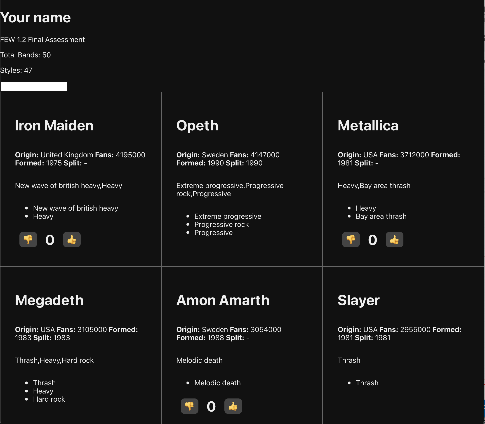

# Assessment

UNDERSTOOD!

## Challenges

--

### Challenge 1: Make a React project

CHECK!

### Challenge 2: Making Simple Components JSX

CHECK!

### Challenge 3: Components and JSON

CHECK!

### Challenge 4: Components and Props

CHECK!

### Challenge 5: Displaying a list

CHECK!

### Challenge 6: Component State

CHECK!

### Challenge 7: Composing with Components

CHECK.

### Challenge 8: Styling Components

CHECK...

### Challenge 9: Display Bands in Grid

I'M GRABBING STRAWS AT THIS POINT

### Challenge 10: Conditional Rendering

---

### Stretch Challenges

Not 'nuff time 🤷🏾‍♂️

## Assessing your knowledge

Use this rubric to assess how your understanding of the learning objectives. You should be striving for an average score of 1 or greater in each row.

| Expectations      | Does not meet (0)                                                        | Meets (1)                                | Exceeds (2)                                                                                                             |
| :---------------- | :----------------------------------------------------------------------- | :--------------------------------------- | :---------------------------------------------------------------------------------------------------------------------- |
| **Completion**    | Less than 70% of the challenges completed.                               | Completed 70 to 100% of the challenges   | Completed the stretch challenges.                                                                                       |
| **Functionality** | Project does not function or throws errors.                              | Project runs without errors.             | Project runs well without warnings in the console.                                                                      |
| **Code Quality**  | Code editor shows warnings or linter errors. Formatting is inconsistent. | Code is well written and well formatted. | Code is well written and well organized. Careful attention has been paid to names for variables, functions, components. |
